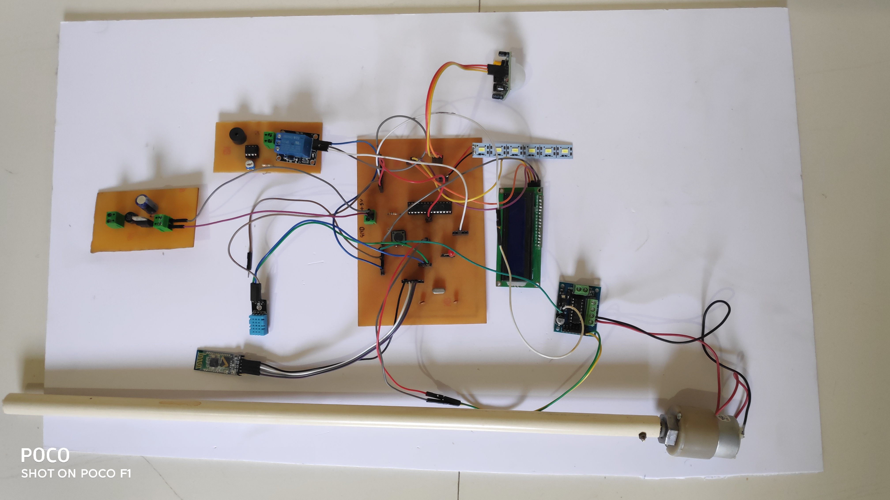
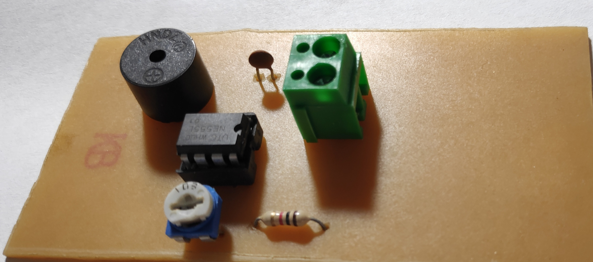
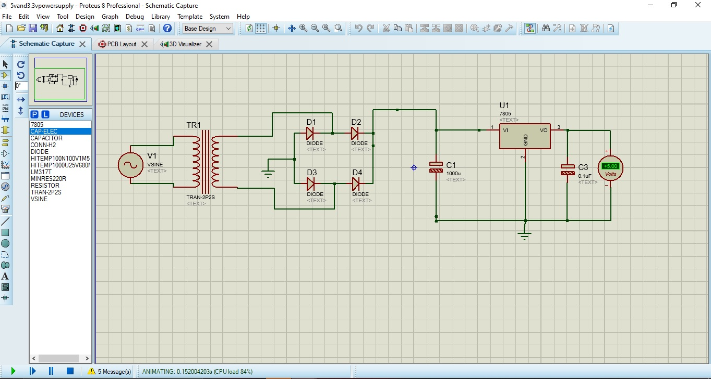
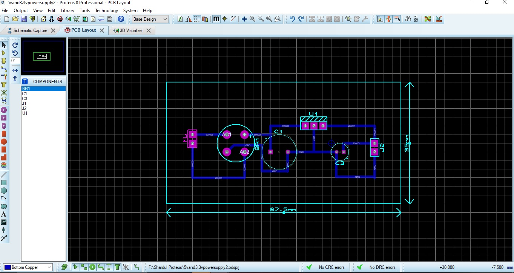

# Smart-Window
Engineering Mini Project based on Arduino (TE)  

  
Eyes are the windows of the soul, and window is the eye in the room. The windows are integral part of a building. The windows are of many types according to their shapes, sizes and pattern on the glass. Windows mainly gives the light, air and heat into the room. Over the century’s windows were developed according to the technology in that era. In the today’s technological era we can use technology for the automation in the windows. 
The smart window project proposes that we can use different modern technologies in window and the window will be smart in its own ways. 
  
Actual Connections(Demo of the Project): 🔽  
  
  
  
Final Circuit Diagram: 🔽  
  
  
  
Mosquito Repellent Circuit using IC-555: 🔽   
  
  
   
Power Supply Simulation Circuit: 🔽   
  
 
  
Power Supply Actual PCB: 🔽    
  
 
  
Power Supply PCB View: 🔽    
  
  
 
